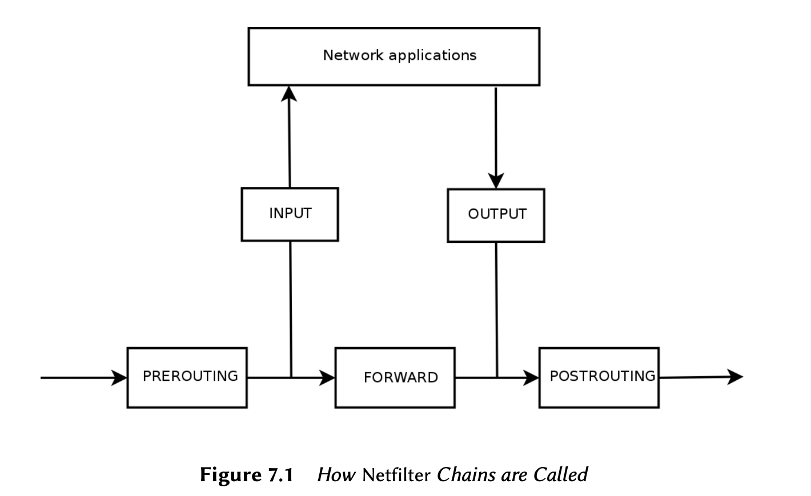

# Linux_Notes
Some notes about Linux

If touchpad does not work in kali, run the following
```bash
rmmod psmouse
modprobe psmouse proto=auto
```

## Linux Fundamentals

### What is Linux and What is it Doing?
The term "Linux" is often used to refer to the entire OS, but in
reality, Linux is the OS kernel, which is started by the boot
loader, which is itself started by the BIOS/UEFI. The kernel assumes
a role similar to that of a conductor in an orchestra--it ensures
coordination between hardware and software. This role includes
managing hardware, processes, users, permissions, and the file
system. The kernel provides a common base to all other programs
on the system and typically runs in *ring zero*, also known as
*kernel space*.

**The User Space**

We use the term *user* to lump together everything that happens
outside of the kernel. Among the programs running in user space
are many core utilities from the GNU project (http://www.gnu.org),
most of which are meant to be run from the command line. You can use
them in scripts to automate many tasks.

**Let's quickly review the various tasks handled by the Linux
Kernel**

1. Driving Hardware
  
The kernel is tasked, first and foremost, with controlling the
computer's hardware components. It detects and configures them
when the computer powers on, or when a device is inserted or
removed (for example, a USB device). It also makes them available
to higher-level software, through a simplified programming 
interface, so applications can take advantage of devices without
having to address details such as which extension slot an option
board is plugged into. The programming interface also provides an
abstraction layer; this allows video-conferencing software, for
example, to use a webcam regardless of its maker and model. The
software can use the *Video for Linux* (V4L) interface and the
kernel will translate function calls of the interface into actual
hardware commands needed by the specific webcam in use.

The kernel exports data about detected hardware through the
`/proc/` and `/sys/` virtual file systems. Applications often access
devices by way of files created within `/dev/`. Specific files
represent disk dives (for instance, `/dev/sda`), partitions
(`/dev/sda1`), mice (`/dev/input/mouse0`), keyboards 
(`/dev/input/event0`), sound cards (`/dev/snd/*`), serial ports
(`/dev/ttyS*`), and other components.

There are two types of device files: *block* and *character*. The
former has characteristics of a block of data: It has a finite size,
so you can access bytes at any position in the block. The latter
behaves like a flow of characters. You can read and write
characters, but you cannot seek to a given position and change
arbitrary bytes. To find out the type of a given device file,
inspect the first letter in the output of `ls -l`. It is either
`b`, for block devices, or `c`, for character devices:

```bash
$ ls -l /dev/sda /dev/ttyS0
brw-rw---- 1 root disk 8, 0 Mar 21 08:44 /dev/sda
crw-rw---- 1 root dialout 4, 64 Mar 30 08:59 /dev/ttyS0
```

As you might expect, disk drives and partitions use block devices,
whereas mouse, keyboard, and serial ports use character devices. In
both cases, the programming interface includes device-specific
commands that can be invoked through the `ioctl` system call.

2. Unifying File Systems

File systems are a prominent aspect of the kernel. Unix-like
systems merge all the file stores in a single hierarchy, which
allows users and applications to access data by knowing its
location within that hierarchy.

The starting point of this hierarchical tree is called the root,
represented by the "/" character. This directory can contain
named subdirectories. For instance, the home subdirectory of `/`
is called `/home/`. This subdirectory can, in turn, contain other
subdirectories, and so on. Each directory can also contain files,
where the data will be stored. The kernel translates between this
naming system and the storage location on a disk.

Unlike other systems, Linux possesses only one such hierarchy, and
it can integrate data from several disks. One of these disks
becomes the root, and the others are *mounted* on directories in
the hierarchy (the Linux command is called `mount`). These other
disks are then available under the *mount points*. This allows
storing users' home directories (tradionally stored within 
`/home/`) on a separate hard disk, which will contain the buxy
directroy (along with home directories of other users). Once you
mount the disk on `/home/`, these directories become accessible at
their usual locations, and paths such as 
`/home/buxy/Desktop/hello.txt` keep working.

There are many file systems formats, corresponding to many ways of
physically storing data on disks. The most widely known are *ext2*,
*ext3*, and *ext4*, but others exist. For instance, *VFAT* is the
filesystem that was historically used by DOS and Windows operating
systems. Linux's support for VFAT allows hard disks to be
accessible under Kali as well as under Windows. In any case, you
must prepare a file system on a disk before you can mount it and
this operation is known as *formatting*.

Commands such as `mkfs.ext3` (where `mkfs` stands for 
*MaKe FileSystem*) handle formatting. These commands require, as a
parameter, a device file representing the partition to be formatted
(for instance, `/dev/sda1`, the first partition on the first 
drive). This operation is destructive and should be rnu only once,
unless you want to wipe a filesystem and start fresh.

There are also network filesystems such as NFS, which do not store
data on a local disk. Instead, data is transmitted through the
network to a server that stores and retrieves them on demand.
Thanks to the file system abstraction, you don't have to worry
about how this disk is connected, since the files remain accessible
in their usual hierarchical way.

3. Managing Processes

A process is a running instance of a program, which requires
memory to store both the program itself and its operating data.
The kernel is in charge of creating and tracking processes. When a
program runs, the kernel first sets aside some memory, loads the
executable code from the file system into it, and then starts the
code running. It keeps information about this process, the most
visible of whih is an identification number known as the *process
identifier* (PID).

Like most modern operating systems, those with Unix-like kernels,
including Linux, are capable of multi-tasking. In other words, they
allow the system to run many processes at the same time. There is
actually only one running process at any one time, but the kernel
divides CPU time into small slices and runs each process in turn.
Since these time slices very short (in the millisecond range),
they create the appearance of processes running in parallel,
although they are active only during their time interval and idle
the rest of the time. The kernel's job is to adjust its scheduling
mechanisms to keep that appearance, while maximizing global system
performance. If the time slices are too long, the application may
not appear as responsive as desired. Too short, and the system
loses time by switching tasks too frequently. These decisions can
be refined with process priorities, where high-priority processes
will run for longer periods and with more frequent time slices than
low-priority processes.

Multi-Processor Systems (and Variants)

The limitation described above, of only one process running at a
time, doesn't always apply: the actual restriction is that there
can be only one runnin process *per processor core*. 
Multi-processor, multi-core, or *hyper-threaded* systems allow
several processes to run in parallel. The same time-slicing
system is used, though, to handle cases where there are more active
processes than available processor cores. This is not unusual; a
basic system, even a mostly idle one, almost always has tens of
running processes.

The kernel allows several independent instances of the same program
to run, but each is allowed access only to its own time slices and
memory. Their data thus remains independent.

4. Rights Management

Unix-like systems support multiple users and groups and allow
control of permissions. Most of the time, a process is identified
by the user who started it. That process is only permitted to
take actions permitted for its owner. For instance, opening a file
requires the kernl to check the process identity against access
permissions.

### How to get a command line

In the event that your graphical interface is broken, you can still
get a command line on virtual consoles (up to six of them can be
accessible through the siz key combinations of CTRL+ALT+F1 through
CTRL+ALT+F6 -- the CTRL key can be omitted if you are already in
text mode, outside of Xorg or Wayland's graphical interface). You
get a very basic login screen where you enter your login and
password before being granted access to the command line with its
shell.

The program handling your input and executing your commands is
called a *shell* (or a command-line interpreter). The default shell
provided in Kali Linux is *Bash* (it stands for *Bourne Again
SHell*). The trailing "$" or "#" character indicates that the shell
is awaiting your input. It also indicates whether Bash recognizes
you as a normal user (the former case with the dollar) or as a
super user (the latter case with the hash).

**Command Line Basics: Browsing the Directory Tree and Managing
Files**

In penetration tests, you will most often receive shell access to
a system after a successful exploit, rather than a graphical user
interface. Proficiency with the command line is essential for
your success as a security professional.

Once a session is open, the `pwd` command (which stands for *print
working directory*) displays your current location in the
filesystem. The current directory is changed with the `cd`
*directory* command (`cd` is for *change directory*). When you
don't specify the target directory, you are taken to your home
directory. When you use `cd -`, you go back to the former working
directory (the one is use before the last `cd` call). The parent
directory is always called `..`, whereas the current directory
is also known as `.`. The `ls` command allows *listing* the
contents of a directory. If you don't provide parameters, `ls`
operates on the current directory.

You can create a new directory with `mkdir` *directory*, and
remove an existing (empty) directory with `rmdir` *directory*.
The `mv` command allows *moving* and renaming files and 
directories; *removing* a file is achieved with `rm` *file*,
and copying a file is done with `cp` *source-file target-file*.

The shell executes each command by running the first program of the
given name that it finds in a directory listed in the PATH
environment variable. Most often, these programs are in `/bin`,
`/sbin`, `/usr/bin`, or `/usr/sbin`. For example, the `ls`
command is found in `/bin/ls`; the `which` command reports the
location of a given executable. Sometimes the command is directly
handled by the shell, in which case, it is called a shell built-in
command (`cd` and `pwd` are among those); the `type` command lets
you query the type of each command.

Note the usage of the `echo` command, which simply displays a
string on the terminal. In this case, it is used to print the
contents of an environment variable since the shell automatically
substitutes variables with their values before executing the
command line.

**Environment Variables**
Environment variables allow storage of global settings for the
shell or various other programs. They are contextual but
inheritable. For example, each process has its own set of
environment variables (they are contextual). Shells, like login
shells, can declare variables, which will be passed down to other
programs they execute (they are inheritable).

These variables can be defined system-wide in `/etc/profile` or
per-user in `~/.profile` but variables that are not specific to
command line interpreters are better put in `/etc/environment`,
since those variables will be inejcted into all user sessions
thanks to a Pluggable Authentication Module (PAM) - even when
no shell is executed.

### The File System

**The Filesystem Hiearchy Standard**

As with other Linux distributions, Kali Linux is organized to be
consistent with the *Filesystem Hiearchy Standard* (FHS), allowing
users of other Linux distributions to easily find their way around
Kali. The FHS defines the purpose of each directory. The top-level
directories are described as follows.
* `/bin/`: basic programs
* `/boot/`: Kali Linux kernel and other files required for its
  early boot process
* `/dev/`: device files
* `/etc/`: configuration files
* `/home/`: user's personal files
* `/lib/`: basic libraries
* `/media/*`: mount points for removable devices (CD-ROM, USB
  keys, and so on)
* `/mnt/`: temporary mount point
* `/opt/`: extra applications provided by third parties
* `/root/`: administrator's (root's) personal files
* `/run/`: volatile runtime data that does not persist across
  reboots (not yet included in the FHS)
* `/sbin/`: system programs
* `/srv/`: data used by servers hosted on this system
* `/tmp/`: temporary files (this directory is often emptied at
  boot)
* `/usr/`: applications (this directory is further subdivided
  into `bin`, `sbin`, `lib` according to the same logic as in
  the root directory) Furthermore, `/usr/share/` contains
  architecture independent data. The `/usr/local/` directory is
  meant to be used by the administrator for installing applications
  manually without overwriting files handled by the packaging
  system (`dpkg`).
* `/var/`: variable data handled by daemons. This includes log
  files, queues, spools, and caches.
* `/proc/` and `/sys/` are specific to the Linux kernel (and not
  part of the FHS). They are used by the kernel for exporting
  data to user space.

**The User's Home Directory**

The contents of a user's home directory are standardized but there
are still a few noteworthy conventions. One is that a user's home
directory is often referred to by a tilde ("~"). That is useful to
know because command interpreters automatically replace a tilde
with the correct directory (which is stored in the HOME 
environment variable, and whose usual value is `/home/user/`).

Tradionally, application configuration files are often stored
directly under your home directory, but the filenames usually
start with a dot (for instance, the `mutt` email client stores its
configuration in `~/.muttrc`). Note that filenames that start with
a dot are hidden by default; the `ls` command only lists them when
the `-a` option is used and graphical file managers need to be
explicitly configured to display hidden files.

Some programs also use multiple configuration files organized in
one directory (for instance, `~/.ssh/`). Some applications (such
as the Firefox web browser) also use their directory to store a
cache of downloaded data. This means that those directories can
end up consuming a lot of disk space.

These configuration files stored directly in your home directory,
often collectively referred to as *dotfiles*, have long
proliferated to the point that these directories can be quite
cluttered with them. Fortunately, an effort led collectively under
the FreeDesktop.org umbrella has resulted in the XDG Base Directory
Specification, a convention that aims at cleaning up these files
and directories. This specification states that configuration files
should be stored under `~/.config`, cache files under `~/.cache`,
and application data files under `~/.local` (or subdirectories
thereof). This convention is slowly gaining traction.

Graphical desktop usually have shortcuts to display the contents
of the `~/Desktop/` directory (or whatever the appropriate
translation is for systems not configured in English).

Finally, the email system sometimes stores incoming emails into
a `~/Mail/` directory.

### Useful Commands

**Displaying and Modifying Text Files**

The `cat` *file* command (intented to concatenate files to the
standard ouput device) reads a file and displays its contents on
the terminal. If the file is too big to fit on a screen, you can
use a pager such as `less` (or `more`) to display it page by page.

The `editor` command starts a text editor (such as Vi or Nano) and
allows creating, modifying, and reading text files. The simples
files can sometimes be created directly from the command 
interpreter thanks to redirection: *command* > *file* creates a
file named *file* containing the output of the given command.
*command* >> *file* is similar except that it appends the output
of the command to the file rather than overwriting it.

```bash
$ echo "Kali rules!" > kali-rules.txt
$ echo "Kali is the best" >> kali-rules.txt
```

**Searching for Files within Files**

The `find` *directory* *criteria* command searches for files in
the hierarchy under *directory* according to several criteria. The
most commonly used criterion is `-name` *filename*, which allows
searching for a file by name. You can also use common wildcards
such as "*" in the filename search.

```bash
$ find /etc -name hosts
$ find /etc -name "hosts*"
```

The `grep` *expression* *files* command searches the contents of
the files and extracts lines matching the regular expression.
Adding the `-r` option enables a recursive search on all files
contained in the directory. This allows you to look for a file
when you only know a part of its contents.

**Managing Processes**

The `ps aux` command lists the processes currently running and
helps to identify them by showing their PID. Once you know the PID
of a process, the `kill` *-signal pid* command allows you to send
it a signal (if you own the process). Several signals exist; most
commonly used are TERM (a request to terminate gracefully) and KILL
(a forced kill).

The command interpreter can also run programs in the background if
the command is followed by "&". By using the ampersand, you resume
control of the shell immediately even though the command is still
running (hidden from view as a background process). The `jobs`
command lists the process running in the background; running
`fg %`*job-number* (for foreground) restores a job to the
foreground. When a command is running in the foreground (either
because it was started normally, or brought back to the foreground
with `fg`), the Control-Z combination pauses the process and
resume controls of the command line. The process can then be
restarted in the background with `bg %`*job-number* (for 
background).

**Managing Rights**

Linux is a multi-user system so its necessary to provide a
permissions system to control the set of authorized operations
on files and directories, which includes all the system resources
and devices (on a Unix system, any device is represented by a file
or directory). This principle is common to all Unix-like systems.

Each file or directory has specific permissions for three
categories of users:
* its owner (symbolized by `u`, as in user)
* its owner group (symbolized by `g`, as in group), representing
  all the members of the group
* the others (symbolized by `o`, as in other)

Three types of rights can be combined:
* reading (symbolized by `r`, as in read);
* writing (or modifying, symbolized by `w`, as in write);
* executing (symbolized by `x`, as in eXecute).

In the case of a file, these rights are easily understood: read
access allows reading the content (including copying), write
access allows changing it, and execute access allows running it
(which will only work if it is a program).

```md
setuid and setgid executables

Two particular rights are relevant to executable files: `setuid`
and setgid (symbolized with the letter "s"). Note that we
frequently speak of bit, since each of these boolean values can be
represented by a 0 or a 1. These two rights allow any user to
execute the program with the rights of the owner or the group,
respectively. This mechanism grants access to features requiring
higher level permissions than those you would usually have.

Since a setuid root program is systematically run under the super-
user identity, it is very important to ensure it is secure and
reliable. Any user who manages to subvert a setuid root program to
call a command of their choice could then impersonate the root
user and have all rights on the system. Penetration testers
regularly search for these types of files when they gain access
to a system as a way of escalating their privileges.
```
A directory is handled differently from a file. Read access gives
the right to consult the list of its contents (files and
directories); write access allows creating or deleting files; and
execute access allows crossing through the directory to access its
contents (for example, the `cd` command). Being able to cross
through a directory without being able to read it gives the user
permission to access the entries therein that are known by name,
but not to find them without knowing their exact name.

```md
setgid directory and sticky bit

The setgid bit also applies to directories. Any newly-created item
in such directories is automatically assigned the owner group of
the parent directory, instead of inheriting the creator's main
group as usual. Because of this, you don't have to change your
main group (with the newgrp command) when working in a file tree
shared between several users of the same dedicated group.

The sticky bit (symbolized by the letter "t") is a permission that
is only useful in directories. It is especially used for temporary
directories where everybody has write access (such as /tmp/): it
restricts deletion of files so that only their owner or the owner
of the parent directory can delete them. Lacking this, everyone
could delete other users' files in /tmp/.
```

3 commands control the permissions associated with a file:
* `chown` *user file* changes the owner of the file
  * Frequently, you want to change the group of a file at the same
  time that you change the owner. The `chown` command has a special
  syntax for that: `chown`*user:group file*
* `chgrp` *group file* alters the owner group
* `chmod` *rights file* changes the permissions for the file

There are two ways

## Securing and Monitoring Kali Linux

### Securing Network Services
In general, it is a good idea to disable services that you do not use. Kali makes it
easy to do this since most network services are disabled by default.

As long as services remain disabled they do not pose any security threat. However,
you must be careful when you enable them because:
* there is no firewall by default, so if they listen on all network interfaces, they
  are effectively publicly available
* some services have no authentication credentials and let you set them on first use;
  others have default (and thus widely known) credentials preset. Make sure to (re)set
  any password to something that only you know.
* many services run as root with full administrator privileges, so the consequences of
  unauthorized access or a security breach are therefore usually severe.

**Default Credentials**

We wont list here all the tools that come with default credentials, instead you
should check the README.Debian file of the respective packages, as well as docs.kali.org
and tools.kali.org to see if the service needs some special care to be secured.

If you run in live mode, the password of the root account is "toor". Thus you
should not enable SSH before changing the password of the root account, or before
having tweaked its configuration to disallow password-based logins.

Also note that the BeFF project (from the already-installed package *beef-xss*) is
also known to have default credentials user "beef", password "beef" hardcoded in
its default configuration file.

### Firewall or Packet Filtering
A *firewall* is a piece of computer equipment with hardware, software, or both that
parses the incoming or outgoing network packets (coming or leaving from a local network)
and only lets through those matching certain predefined conditions.

A filtering network gateway is a type of firewall that protects an entire network.
It is usually installed on a dedicated machine configured as a gateway for the network
so that it can parse all packets that pass in and out of the network. Alternatively,
a local firewall is a software service that runs on one particular machine in order
to filter or limit access to some services on that machine, or possibly to prevent
outgoing connections by rogue software that a user could, willingly or not, have installed.

The Linux kernel embeds the *netfilter* firewall. There is no turn-key solution for
configuring any firewall since network and user requirements differ. However, you
can control *netfilter* from user space with the `iptables` and `ip6tables` commands.
The difference between these two commands is that the former works for IPv4 networks,
whereas the latter works on IPv6. Since both network protocol stacks will probably be
around for many years, both tools will need to be used in parallel. You can also use
the excellent GUI-based `fwbuilder` tool, which provides a graphical representation
of the filtering rules.

However you decide to configure it, *netfilter* is Linux's firewall implementation,
so let's take a closer look at how it works.

#### Netfilter Behavior
*Netfilter* uses 4 distinct tables, which store rules regulating 3 kinds of
operations on packets:
* filter concerns filtering rules (accepting, refusing, or ignoring a packet);
* nat (Network Address Translation) concerns translation of source or destination
  addresses and ports of packets;
* mangle concerns other changes to the IP packets (including the ToS--Type of Service--field
  and options);
* raw allows other manual modifications on packets before they reach the connection
  tracking system.

Each table contains lists of rules called *chains*. The firewall uses standard chains
to handle packets based on predefined circumstances. The administrator can create
other chains, which will only be used when referred by one of the standard chains
(either directly or indirectly).

The filter table has 3 standard chains:
* INPUT: concerns packets whose destination is the firewall itself;
* OUTPUT: concerns packets emitted by the firewall;
* FORWARD: concerns packets passing through the firewall (which is neither their
  source nor their destination).

The nat table also has 3 standard chains:
* PREROUTING: to modify packets as soon as they arrive;
* POSTROUTING: to modify packets when they are ready to go on their way;
* OUTPUT: to modify packets generated by the firewall itself.



Each chain is a list of rules; each rule is a set of conditions and an action to perform when the
conditions are met. When processing a packet, the firewall scans the appropriate chain, one rule
after another, and when the conditions for one rule are met, it jumps (hence the `-j` option in
the commands) to the specified action to continue processing. The most common behaviors are standardized
and dedicated actions exist for them. Taking one of these standard actions interrupts the processing
of the chain, since the packet's fate is already sealed (barring an exception mentioned below). Listed
below are the *Netfilter* actions:
* ACCEPT: allow the packet to go on its way
* REJECT: reject the packet with an Internet control message protocol (ICMP) error packet (the `--reject`
  with *type* option of `iptables` determines the type of error to send).
* DROP: delete (ignore) the packet
* LOG: log (via `syslogd`) a message with the description of the packet. Note that this option does not
  interrupt processing, and the execution of the chain continues at the next rule, which is why logging
  refused packets requires both a LOG and a REJECT/DROP rule. Common parameters associated with logging
  include:
  * `--log-level`, with default value `warning`, indicates the `syslog` severity level
  * `--log-prefix` allows specifying a text prefix to differentiate between logged messages
  * `--log-tcp-sequence`, `log-tcp-options`, and `log-ip-options` indicate extra data to be integrated
    into the message: respectively, the TCP sequence number, TCP options, and IP options.
* ULOG: log a message via `ulogd`, which can be better adapted and more efficient than `syslogd` for
  handling large number of messages; note that this action, like LOG, also returns processing to the
  next rule in the calling chain.
* *chain_name*: jump to the given chain and evaluate its rules.
* RETURN: interrupt processing of the current chain and return to the calling chain; in case the current
  chain is a standard one, there's no calling chain, so the default action (defined with the `-P` options
  to `iptables`) is executed instead.
* SNAT (only in the nat table): apply *Source Network Address Translation* (SNAT). Extra options
  describe the exact changes to apply, including the `--to-source` *address:port* option, which defines
  the new source IP address and/or port
* DNAT (only in the nat table): apply *Destination Network Address Translation* (DNAT). Extra options
  describe the exact changes to apply, including the `--to-destination` *address:port* option, which
  defines the new destination IP address and/or port.
* MASQUERADE (only in the nat table): apply *masquerading* (a special case of source NAT).
* REDIRECT (only in the nat table): transparently redirect a packet to a given port of the firewall
  itself; this can be used to set up a transparent web proxy that works with no configuration on the
  client side, since the client thinks it connects to the recipient whereas the communications 
  actually go through the proxy. The `--to-ports` *port(s)* option indicates the port, or port range, where
  the packets should be redirected.

##### What is ICMP?
*Internet Control Message Protocol* (ICMP) is the protocol used to transmit ancillary (adjective: providing
necessary support to the primary activities or operation of an organization, institution, industry, or system)
information on communications. It tests network connectivity with the `ping` command, which sends an ICMP
*echo request* message. It signals a firewall rejecting a packet, indicates an overflow in a receive buffer,
proposes a better route for the next packets in the connection, and so on. This proposal is defined by several
RFC documents. RFC777 and RFC792 were the first, but many others extended and/or revised the protocol.

For reference, a receive buffer is a small memory zone storing data between the time it arrives from the
network and the time the kernel handles it. If the zone is full, new data cannot be received and ICMP
signals the problem, so that the emitter can slow down its transfer rate (which should ideally reach an
equilibrium after some time).

Note that although an IPv4 network can work without ICMP, ICMPv6 is strictly required for an IPv6 network,
since it combines several functions that were, in the IPv4 world, spread across ICMPv4, 
*Internet Group Membership Protocol* (IGMP), and *Address Resolution Protocol* (ARP), ICMPv6 is defined in
RFC4443.

#### Syntax for `iptables` and `ip6tables`
The `iptables` and `ip6tables` commands are used to manipulate tables, chains, and rules. Their `-t` *table*
option indicates which table to operate on (by default, *filter*).

##### Commands
The major options for interacting with chains are listed below:
* -L *chain* lists the rules in the chain. This is commonly used with the `-n` option to disable name resolution
  (for example, `iptables -n -L INPUT` will display the rules related to incoming packets).
* -N *chain* creates a new chain. You can create new chains for a number of purposes, including testing a new
  network service or fending off a network attack.
* -X *chain* deletes an empty and unused chain (for example, `iptables -X ddos-attack`).
* -A *chain rule* adds a rule at the end of the given chain. Remember that rules are processed from top
  to bottom so be sure to keep this in mind when adding rules.
* -I *chain rule_num rule* inserts a rule before the rule number *rule_num*. As with the -A option,
  keep the processing order in mind when inserting new rules into a chain.
* -D *chain rule_num* (or -D *chain rule*) deletes a rule in a chain; the first syntax identifies the rule
  to be deleted by its number (`iptables -L --line-numbers` will display these numbers), while the latter
  identifies it by its contents.
* -F *chain* flushes a chain (deletes all its rules). For example, to delete all of the rules related
  to outgoing packets, you would run `-iptables -F OUTPUT`. If no chain is mentioned, all the rules in the
  table are deleted.
* -P *chain action* defines the default action, or "policy" for a given chain; note that only standard
  chains can have such a policy. To drop all incoming traffic by default, you would run `iptables -P INPUT DROP`.

##### Rules
Each rule is expressed as *conditions* `-j` *action_options*. If several conditions are described in
the same rule, then the criterion is the conjunction (logic *AND*) of the conditions, which is at least
as restrictive as each individual condition.

The `-p` *protocol* condition matches the protocol field of the IP packet. The most common values are
tcp, udp, icmp, and icmpv6. This condition can be complemented with conditions on the TCP ports, with
clauses such as `--source-port` *port* and `--destination-port` *port*.

**Negating Conditions**

Prefixing a condition with an exclamation mark negates the condition. For example, nagating a condition
on the `-p` option matches "any packet with a different protocol than the one specified". The negating
mechanism can be applied to all other conditions as well.

The `-s` *address* or `-s` *network/mask* condition matches the source address of the packet.
Correspondingly, `-d` *address* or `-d` *network/mask* matches the destination address.

The `-i` *interface* condition selects packets coming from the given network interface. `-o`
*interface* selects packets going out on a specific interface.

The `--state` *state* condition matches the state of a packet in a connection (this requires
the `ipt_conntrack` kernel module, for connection tracking). The NEW state describes a packet
starting a new connection, ESTABLISHED matches packets belonging to an already existing connection,
and RELATED matches packets initiating a new connection related to an existing one (which is
useful for the ftp-data connections in the "active" mode of the FTP protocol).

There are many available options for `iptables` and `ip6tables` and mastering them all requires
a great deal of study and experience. However, one of the options you will use most often
is the one to block malicious network traffic gome a host or range of hosts. For example, to
silently block incoming traffic from the IP address 10.0.1.5 and the 31.13.74.0/24 class C subnet:
```bash
iptables -A INPUT -s 10.0.1.5 -j DROP
iptables -A INPUT -s 31.13.74.0/24 -j DROP
iptables -n -L INPUT # list all rules
```

Another commonly-used `iptables` command is to permit network traffic for a specific service
or port. To allow users to connect to SSH, HTTP, and IMAP, you could run the following commands:
```bash
iptables -A INPUT -m state --state NEW -p tcp --dport 22 -j ACCEPT
iptables -A INPUT -m state --state NEW -p tcp --dport 80 -j ACCEPT
iptables -A INPUT -m state --state NEW -p tcp --dport 143 -j ACCEPT
iptables -n -L INPUT
```

It is considered to be good computer *hygiene* to clean up old and unnecessary rules. The
easiest way to delete `iptables` rules is to reference the rules by line number, which you can
retrieve with the `--line-numbers` option. Be wary though: dropping a rule will renumber all the
rules appearing further down in the chain.

